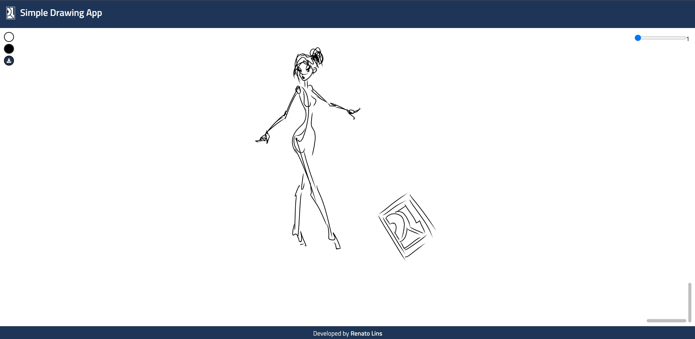

# Simple Drawing App

A drawing application featuring core functionalities such as brush strokes, undo (Ctrl+Z), adjustable color and brush size, and export options. The drawing functionality relies on [perfect-freehand](https://www.npmjs.com/package/perfect-freehand) module. This application is a work in progress and is not yet considered a final product. It serves as both a coding practice project and a portfolio piece. Additional features may be implemented in the future to elevate it into a fully functional drawing application.

## Print



## Getting Started

### Prerequisites

- Node.js (LTS version recommended)
- pnpm package manager (Or similar)

### Installation

1. Clone the repository:

   ```
   git clone https://github.com/renatolinsdigital/simple-drawing-app.git
   cd drawing-app
   ```

2. Install dependencies:
   ```
   pnpm install
   ```

### Running the Project

To start the development server:

```
pnpm dev
```

This will start the application on `http://localhost:5173`.
